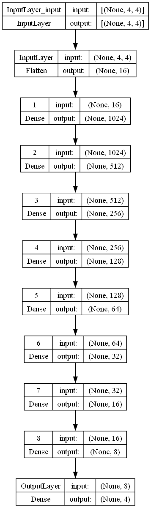
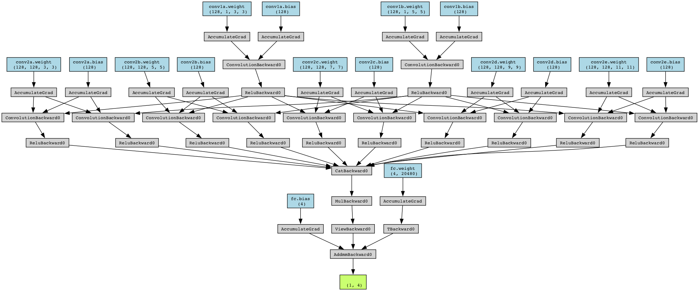

# 2048 with RL

The project, carried out for the Artificial Intelligence course, ended with the realization of two different models of Deep-Q-Learning.

## Authors

- [@Pasquale Somma](https://github.com/Paky29)
- [@Rebecca Di Matteo](https://github.com/rebeccadimatteo)
- [@Antonio La Marca](https://www.github.com/octokatherine)

### Model 1
The first model was made with Keras v3.0. 
[Source code](model/ModelOne.py)

### Model 2
The second model uses CNNs and was made with Torch   
[Source code](model/ModelTwo.py)

